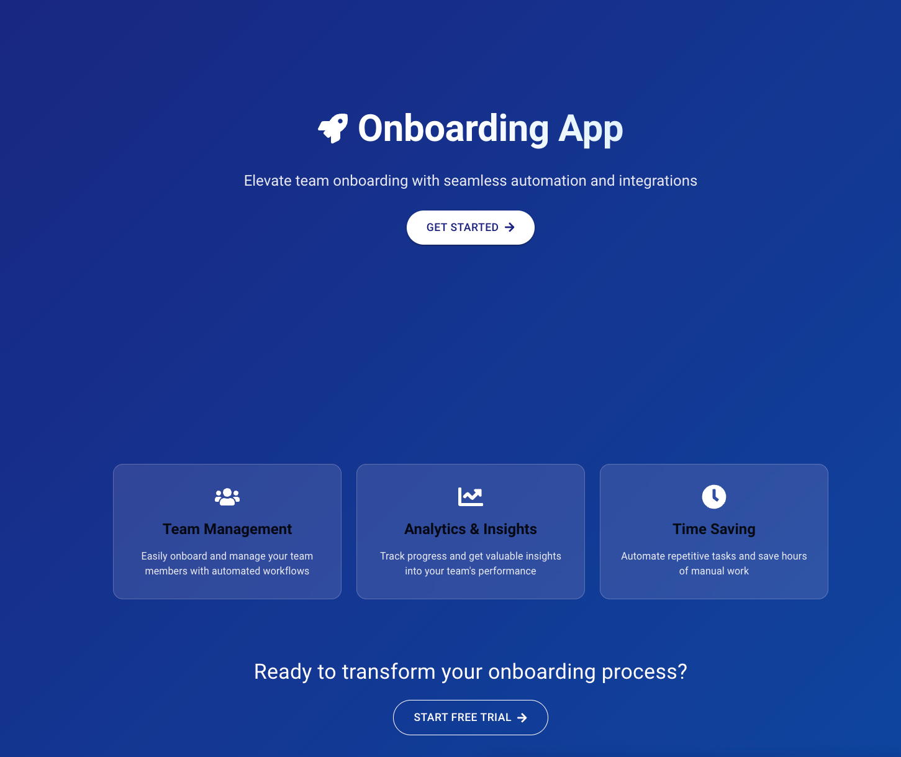

# Onboarding App

## Goal

🧠 AI Agents for Enterprise Workflows

**Overview:**

Autonomous AI agents designed to streamline and automate internal enterprise workflows such as onboarding, procurement
approvals, and compliance checks. These agents integrate seamlessly with tools like Slack, Jira, SAP, and other
enterprise systems to reduce manual overhead and improve operational efficiency.

**Why Now:**

Recent advances in Large Language Models (LLMs) have made it feasible to deploy multi-step, reasoning-capable agents.
Enterprises are actively seeking intelligent automation to lower costs, increase productivity, and enhance agility in
managing internal processes.

**Target Customers:**

Mid to large-sized enterprises with complex, cross-functional workflows that require high coordination, compliance, and
repeatability.

**Key Features:**

- Cross-tool unified onboarding (Slack, Jira, GitHub, Google etc.)

**Planned Features:**

- Context-aware, multi-step task automation
- Human-in-the-loop escalation
- Workflow auditing and traceability
- Onboarding chat agent that guides new employees through setup and knowledge transfer

**Use Cases:**

- Employee onboarding coordination
- Procurement and vendor approvals
- Internal compliance workflows
- IT service management automation



## Project Structure

- `integrations/`: Contains all service integrations
    - `github/`: GitHub integration service
    - `google/`: Google Calendar integration service
    - `jira/`: Jira integration service
    - `slack/`: Slack integration service
- `api-layer/`: API gateway layer (aggregates integration services)
- `ui-app/`: Frontend UI application (React)

## License and Commercial Use

This project is distributed under the [Apache License, Version 2.0](LICENSE).

For paid setup assistance or commercial licensing options that benefit the
project maintainer, [contact me](mailto:teja230@gmail.com).

## Prerequisites

The application requires the following dependencies:

- Java 17 or higher
- Maven 3.6 or higher
- Node.js 18 or higher
- Redis 6 or higher
- Nginx 1.18 or higher

## Setup

1. Clone the repository:
   ```bash
   git clone <repository-url>
   cd api
   ```

2. Configure environment variables
   For each integration service, configure the respective credentials in their `application.properties` files:

   - GitHub (`integrations/github/src/main/resources/application.properties`):
     ```properties
     github.oauth.client-id=<your-client-id>
     github.oauth.client-secret=<your-client-secret>
     github.oauth.redirect-uri=http://localhost:8081/api/github/oauth/callback
     ```

   - Google Calendar (`integrations/google/src/main/resources/application.properties`):
     ```properties
     google.oauth.client-id=<your-client-id>
     google.oauth.client-secret=<your-client-secret>
     google.oauth.redirect-uri=http://localhost:8082/api/google/calendar/oauth/callback
     ```

   - Jira (`integrations/jira/src/main/resources/application.properties`):
     ```properties
     jira.oauth.client-id=<your-client-id>
     jira.oauth.client-secret=<your-client-secret>
     jira.oauth.redirect-uri=http://localhost:8084/api/jira/oauth/callback
     ```

   - Slack (`integrations/slack/src/main/resources/application.properties`):
     ```properties
     slack.oauth.client-id=<your-client-id>
     slack.oauth.client-secret=<your-client-secret>
     slack.oauth.redirect-uri=http://localhost:8083/api/slack/oauth/callback
     ```

3. Start all services:
   ```bash
   ./start-services.sh
   ```
   This script will:
   - Check for required dependencies
   - Install missing dependencies if needed (using Homebrew on macOS, apt-get on Linux)
   - Start Redis (if not already running)
   - Start Nginx (without sudo on macOS, with sudo on Linux)
   - Start all backend services (API Layer, GitHub, Google, Slack, Jira)
   - Start the UI application

4. Stop all services:
   ```bash
   ./stop-services.sh
   ```
   This will gracefully stop all running services.

## How to Run

### Start All Services (Preferred: Microservices)

Use the provided script to start all backend services in microservices mode:

```sh
./start-services.sh
```

This will:

- Check and install any missing dependencies (using Homebrew on macOS, apt-get on Linux)
- Start Redis (if not already running)
- Start Nginx (without sudo on macOS, with sudo on Linux)
- Start all backend services:
   - GitHub Integration (port 8081)
   - Google Calendar Integration (port 8082)
   - Slack Integration (port 8083)
   - Jira Integration (port 8084)
   - API Layer (port 8085)
- Start the UI application (port 3000)

### Stop All Services

To stop all services (including the UI, Redis, and Nginx), run:

```sh
./stop-services.sh
```

This script will:

- Stop all integration services (ports 8081, 8082, 8083, 8084, 8085)
- Stop the UI (React dev server on port 3000)
- Shut down Redis
- Stop Nginx (without sudo on macOS, with sudo on Linux)

### Frontend UI

The UI is started automatically by `start-services.sh`. If you need to run it manually:

```sh
cd ui-app
npm install
npm start
```

The UI will be available at `http://localhost:3000`.

### Nginx Reverse Proxy

The Nginx reverse proxy is started automatically by `start-services.sh`. If you need to manage it manually:

On macOS (Homebrew):

```sh
nginx -c /path/to/project/nginx.conf
nginx -s reload  # To reload configuration
nginx -s stop    # To stop
```

On Linux:

```sh
sudo nginx -c /path/to/project/nginx.conf
sudo nginx -s reload  # To reload configuration
sudo nginx -s stop    # To stop
```

**All API and UI access should be done via Nginx on port 8080.**

## Service Health Monitoring

The application includes a health check dashboard that monitors the status of all integration services. The main health
check endpoint is:

- System Health: `http://localhost:8080/api/system/health`

Each service also exposes a Spring Boot Actuator health endpoint at `/actuator/health` on its respective port:

- API Layer: `http://localhost:8085/actuator/health`
- Slack: `http://localhost:8083/actuator/health`
- GitHub: `http://localhost:8081/actuator/health`
- Jira: `http://localhost:8084/actuator/health`
- Google: `http://localhost:8082/actuator/health`

### Health Check UI

The health check dashboard is available at `http://localhost:3000/health` after logging in. It provides:

- Real-time status of all services
- Last checked timestamp
- Service details and uptime
- Manual refresh option
- Auto-refresh every 30 seconds

## Key Endpoints (All via Nginx on port 8080)

### GitHub Integration
- `/api/github/oauth/url` - Get GitHub OAuth URL
- `/api/github/oauth/callback` - GitHub OAuth callback
- `/api/github/status` - Check GitHub integration status
- `/actuator/health` - Service health check

### Google Calendar Integration
- `/api/google/calendar/oauth/url` - Get Google Calendar OAuth URL
- `/api/google/calendar/oauth/callback` - Google Calendar OAuth callback
- `/api/google/calendar/status` - Check Google Calendar integration status
- `/actuator/health` - Service health check

### Slack Integration
- `/api/slack/oauth/url` - Get Slack OAuth URL
- `/api/slack/oauth/callback` - Slack OAuth callback
- `/api/slack/status` - Check Slack integration status
- `/actuator/health` - Service health check

### Jira Integration
- `/api/jira/oauth/url` - Get Jira OAuth URL
- `/api/jira/oauth/callback` - Jira OAuth callback
- `/api/jira/status` - Check Jira integration status
- `/actuator/health` - Service health check

## Nginx Reverse Proxy Setup

The `nginx.conf` file in the project root configures Nginx as a reverse proxy for all services. It handles:

- Health check endpoint routing
- API endpoint routing
- CORS configuration
- Request forwarding to appropriate services

### Configuration Details

```nginx
# Health check endpoints
location /api/system/health {
    proxy_pass http://localhost:8085/api/system/health;
}
location /actuator/health {
    proxy_pass http://localhost:8085/actuator/health;
}
location /api/jira/ {
    proxy_pass http://localhost:8084/api/jira/;
}
location /api/slack/ {
    proxy_pass http://localhost:8083/api/slack/;
}
location /api/github/ {
    proxy_pass http://localhost:8081/api/github/;
}
location /api/google/ {
    proxy_pass http://localhost:8082/api/google/;
}
```

## Running Tests

Run backend and frontend tests to verify the installation:

```sh
mvn test
npm test --prefix ui-app
```

If Maven fails to resolve dependencies because of restricted network access,
pre-install them or provide an offline repository via the `~/.m2` directory
before running the tests.

## Development Notes

- Each service uses an in-memory H2 database for development
- H2 console is available at `/h2-console` for each service
- Default security passwords are generated for each service
- For production:
    - Secure your credentials using environment variables or a secrets manager
    - Configure proper database connections
    - Set up proper security configurations
    - Use HTTPS for all endpoints

## Troubleshooting

1. **Port Already in Use**
   If you see "Port X is already in use" error:
   ```sh
   # Find the process using the port
   lsof -i :<port-number>
   # Kill the process
   kill <process-id>
   ```

2. **Service Not Responding**
    - Check if the service is running
    - Verify the port is not blocked
    - Check service logs for errors
    - Ensure all required environment variables are set
   - Check the health check dashboard for service status

3. **OAuth Issues**
    - Verify OAuth credentials are correct
    - Check redirect URIs match exactly
    - Ensure callback URLs are accessible

4. **Health Check Issues**
    - Verify all services are running
    - Check Nginx configuration
    - Ensure services are accessible on their respective ports
    - Check service logs for any errors

5. **Offline Builds**
    - If Maven or npm cannot download dependencies, populate a local
      repository in `~/.m2` and install node packages manually before
      running builds or tests.

